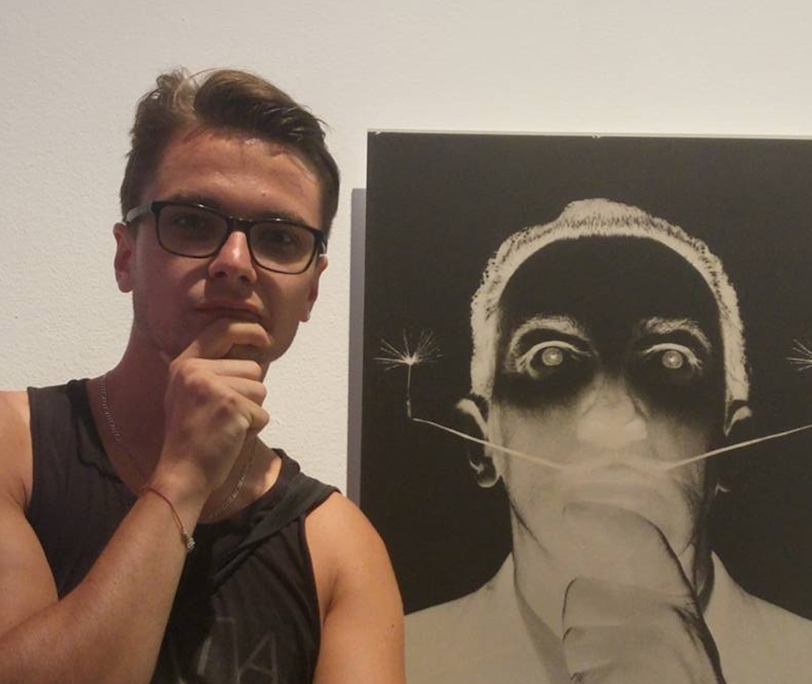

<link rel="stylesheet" href="styles.css" type="text/css">

# There are **two PhD student positions** 
## check out the details in 'Open positions'

  **Aleksandra Pękowska, PI**

I graduated from the University of Lodz with a MS in biology (spec. biophysics, lab of Prof. Grzegorz Bartosz, Dept. of Molecular Biophysics) in 2006. For my Ph.D., I joined the lab of Dr. Pierre Ferrier  at the CIML in Marseilles. Combining a variety of high throughput genome analysis approaches (including ChIP-seq, RNA-seq, and microarray-based assays) and computational biology tools, we discovered a chromatin signature allowing to distinguish active from poised enhancers (Pękowska A. et al., 2011, *EMBO Journal*). In a purely in silico study, we show for the first time, that tissue-specific genes display a unique pattern of histone modifications (Pękowska A. et al., 2010 *Genome Research*). 

In 2011, I obtained the EIPOD fellowship (EMBL/Marie Curie actions) and joined groups of Dr. Wolfgang Huber, Dr. Lars Steinmetz, and Dr. Paul Bertone at EMBL/EBI for an interdisciplinary postdoc. My goal was to define the relationship between cellular plasticity and chromatin topology. Using stem cell models and in-situ Hi-C, we revealed that differentiation of pluripotent stem cells to neuronal lineage coincides with a genome-wide buildup of chromatin loops and strengthening of chromatin boundaries (Pękowska A. et al., *Cell Systems*). 

In 2016, I joined the team of Dr. Rafael Casellas at NIAMS (NIH) in Bethesda, US. In a recent paper, we described architectural stripes - specialized chromatin structures frequently involving super-enhancers (Vian L.#, Pękowska A.# et al. 2018 *Cell*, # equal contribution). Combining CRISPR-Cas9, Hi-C and ChIP-seq, we show that stripes rely on the action of CTCF and cohesins; and that their formation requires constant energy input. 

In my spare time, I enjoy astronomy, history, and hiking.

___________________________________________

  **Aleksandra Piotrowska, Research Technician**

I am interested in the molecular bases of inheritance, in particular, in how epigenetics shapes the identity of a cell. 

In 2019, I obtained a Master’s Degree in Molecular Biotechnology at the University of Warsaw.  My project was aimed at the development of molecular biology methods to diagnose chosen rare genetic disorders.

I joined the Dioscuri Centre for Chromatin Biology and Epigenomics in Fall 2019. I derive and maintain induced pluripotent stem cell lines from mammals (mouse, primates, and humans). I am still learning about their needs and moods. I am also responsible for the technical infrastructure in the lab.

Besides my implication in the lab, I study bioethics at the University of Warsaw. I am interested in ethical aspects of biotechnology in particular, the moral implications of the use of human ES cells and of human genome editing. 

___________________________________________

  **Marcin Janowski, PostDoc**

For my PhD I joined Marek Mutwil’s lab at the Max Planck institute for Molecular Plant Physiology in Potsdam. I focused on the biology of AtRsgA - an essential ribosomal GTPase. Due to its role in rRNA maturation, I had the opportunity to develop strong skills in molecular biology and protein biochemistry. I was also involved in the generation and interpretation of “omics” data (RNA-seq, Mass-spec).

Currently, my interests focus on proteins implicated in the regulation of chromatin topology. Using high-throughput techniques, I aim to uncover new mechanisms that govern the dynamics of chromatin organization during the differentiation of mouse embryonic stem cells to neurons. In particular, I would like to identify novel factors involved in the regulation of CTCF-bound chromatin insulators. 

___________________________________________

  **Katarzyna Ciuba, PostDoc**

I have graduated as a MSc of Biochemistry at Jagiellonian University in Cracow. Then, I joined Pekka Lappalainen's lab at the University of Helsinki as a PhD student. I took advantage of a wide range of cell biology, microscopy and biochemistry methods to unravel mechanisms regulating assembly and function of contractile actin-based structures in non-muscle cells.

Currently, I am interested in functional genomics of astrocytes. Taking advantage of genome editing methods accompanied by broad molecular biology and microscopy techniques, I aim to decipher the role of certain astrocyte genes in functional and evolutionary context. 

In my spare time I experiment with coffee and travels.

___________________________________________

