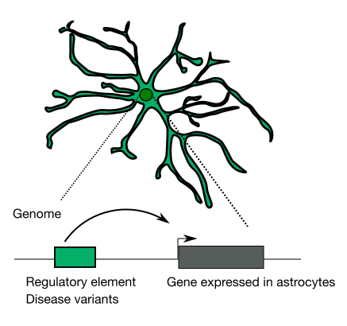
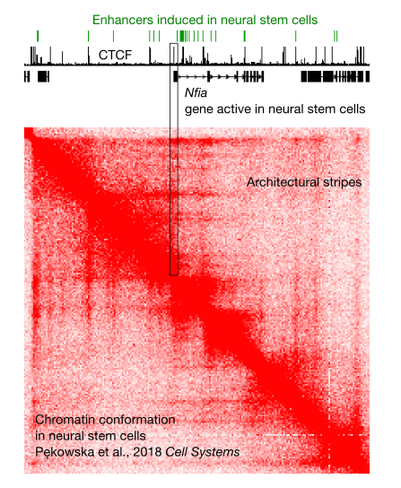

<link rel="stylesheet" href="styles.css" type="text/css">

# Regulatory network of astrocytes

 

Astrocytes are the most abundant glial cell type in the central nervous system. They are critical for brain plasticity. Several neurological conditions, including Alzheimer's disease and Down syndrome, feature aberrant activity of astrocytes. Thus, the dissection of the gene regulatory network underlying astrocyte identity will be instrumental for our understanding of how these cells control brain functions in healthy as well as in neuropathological conditions. 

___________________________________________

# Evolution of astrocytes in mammals

 

Astrocyte lineage underwent a remarkable evolution in mammals. In comparison to rodents, human astrocytes display marked morphological and functional changes. These differences are a result of a profoundly altered pattern of gene expression in human astrocytes as compared to their murine counterparts. Our goal is to identify the evolutionary changes in the regulatory DNA sequences that underlie the expansion of astrocytes in humans.

___________________________________________

# Chromatin topology 

 

We are taking advantage of in-vitro mouse neural differentiation as a model system to investigate the impact of chromatin topology on transcriptional regulation. We are interested in the role of the chromatin architectural protein CTCF in the regulation of promoter-enhancer interactions. We are also aiming to provide insights into the molecular mechanisms orchestrating the binding of CTCF to chromatin. As an integral part of our research, we use and develop computational tools for the analysis of chromatin topology. 
 

    

___________________________________________
