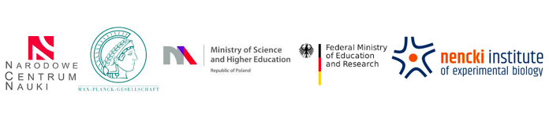

[Dioscuri](https://ncn.gov.pl/dioscuri/) is a program initiated by the Max Planck Society, managed jointly with the National Science Centre (Poland) and mutually funded by the Polish Ministry of Science and Higher Education and the German Federal Ministry of Education and Research.

<link rel="stylesheet" href="styles.css" type="text/css">

## Mission of the lab
We use stem cell models, high throughput sequencing technologies (ChIP-seq, ATAC-seq, RNA-seq, Hi-C), CRISPR-Cas9 mediated genome editing, and computational tools, to **decipher the regulatory networks orchestrating astrocyte functions in mammals and to understand the interplay between chromatin topology and gene expression**.

We are also a part of the [**NIH Regulome Project**](https://regulome.github.io/People/index.html)

## Selected publications
**Pękowska A.**^, Klaus B, Xiang W., Severino J., Daigle N., Klein F.A., Oleś M., Casellas R., Ellenberg J., Steinmetz L.M.S., Bertone P.^, Huber W.^ Gain of CTCF-anchored chromatin loops marks the exit from naive pluripotency. *Cell Systems* Nov. 28; 7(5):482-495

Vian L.#, **Pękowska A.**#, Rao SSR.#, Kieffer-Kwon K-R#, Jung S#, Baranello L., Huang SC., El Khattabi L., Dose M., Pruett N., Sanborn AL., Canela A., Maman Y., Oksanen A., Resch W., Li X., Lee B., Kovalchuk AL., Tang Z., Nelson S., Di Pierro M., Cheng RR., Machol I., St Hilaire BG., Durand NC., Shamim MS., Stamenova EK., Onuchic JN., Ruan Y., Nussenzweig A., Levens D., Aidn EL., Casellas R. The energetics and physiological impact of cohesin extrusion. *Cell* 2018 May 17;173(5):1165-1178.e20.

Schwarzer W.#, Abdennur N.#, Goloborodko A.#, **Pękowska A.**, Fudenberg G., Loe-Mie Y., Fonseca N.A., Huber W, Haering C., Mirny L., Spitz F. Two independent modes of chromosome organization are revealed by cohesin removal. *Nature* 2017 Nov 2;551(7678):51-56

**Pękowska A.**#, Benoukraf T.#, Zacarias-Cabeza J.#, Belhocine M., Koch F., Holota H., Imbert J. Andrau JC., Ferrier P., Spicuglia S. H3K4 tri-methylation provides an epigenetic signature of active enhancers. *EMBO J.* 2011;(July):1–13. 

**Pękowska A.**, Benoukraf T., Ferrier P., Spicuglia S. A unique H3K4me2 profile marks tissue-specific gene regulation. *Genome Research*, 2010 Nov; 20(11):1493–502. 

*#* equal contribution
^ corresponding author

